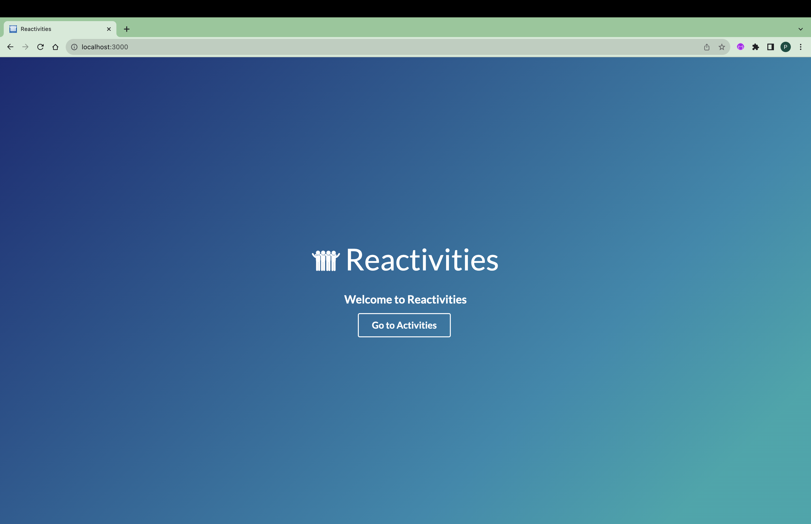
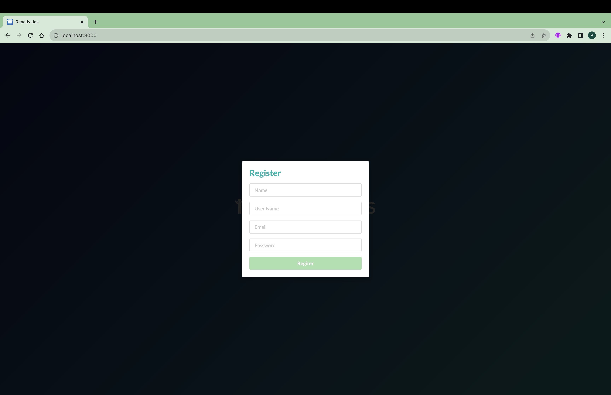
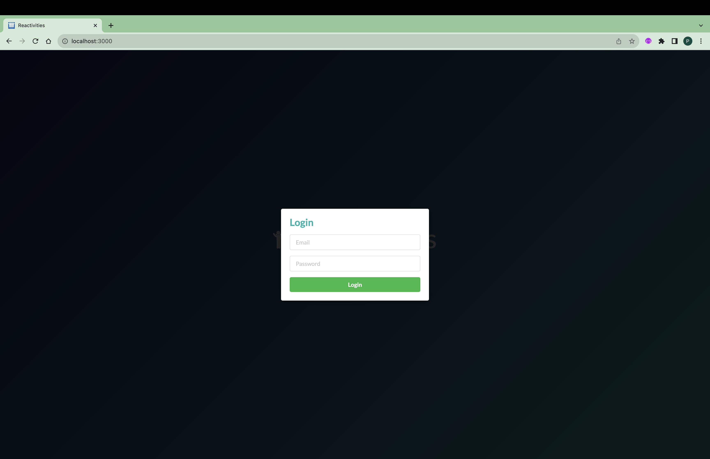
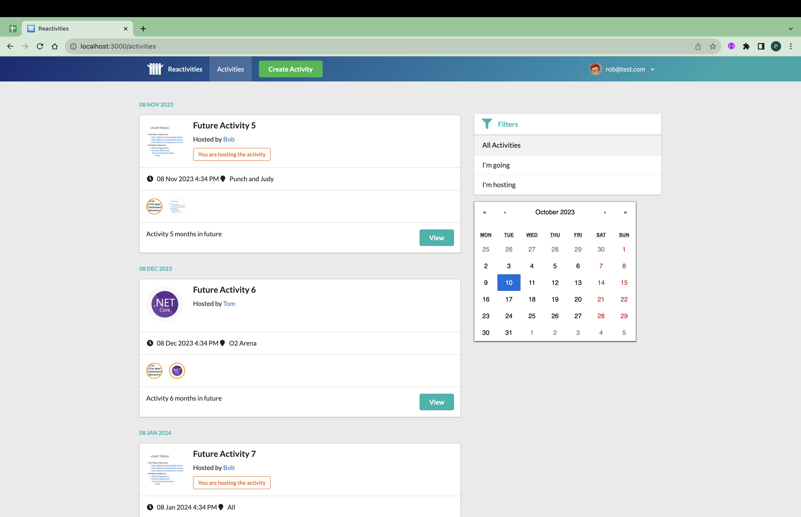
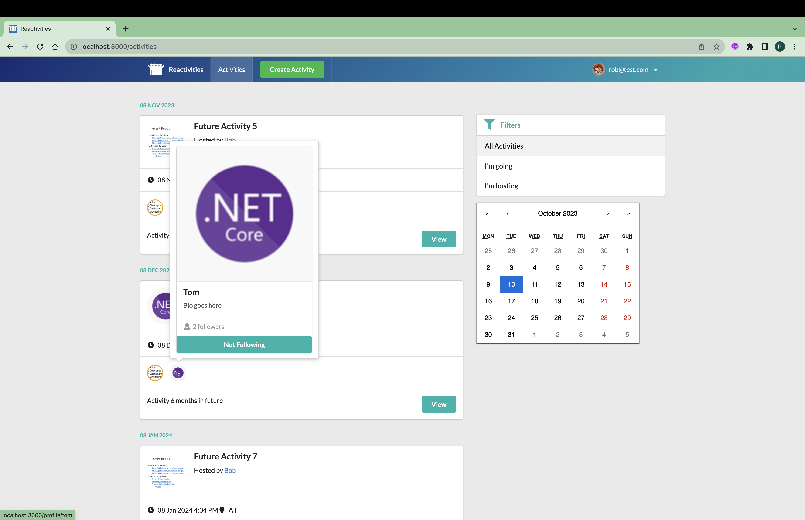
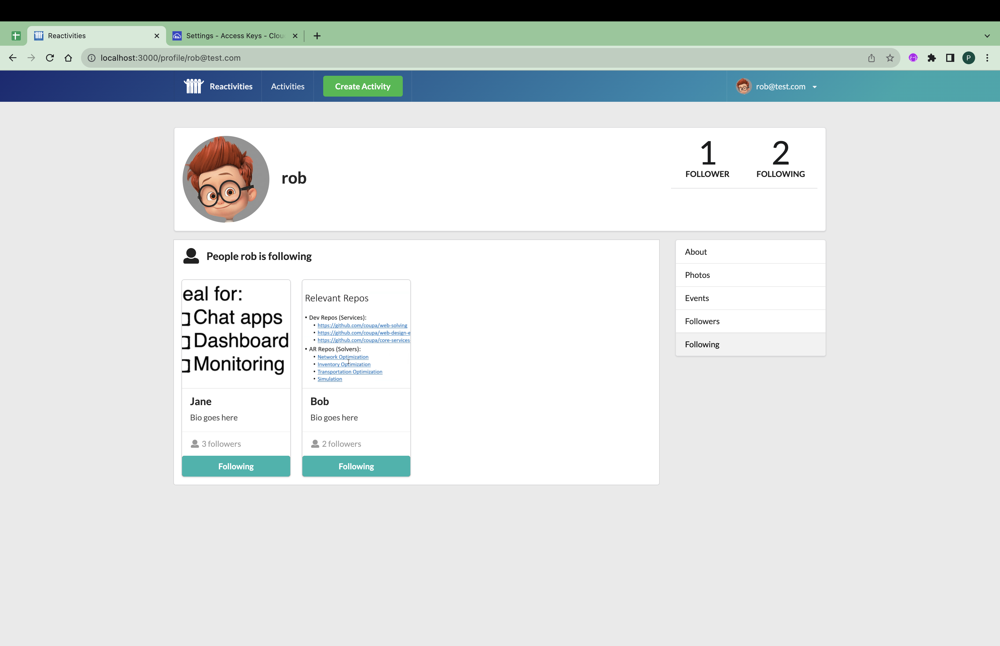
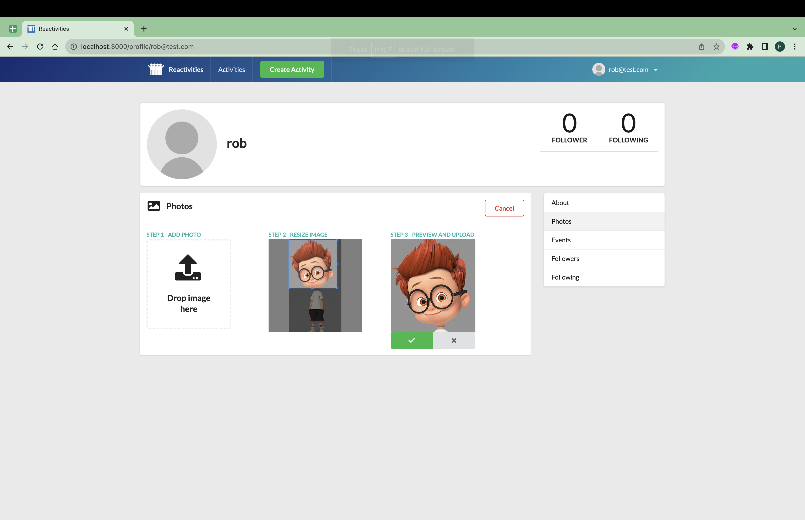

# Reactivities (checkout to tag 0.0.2 to get the below result)

command to checkout to tag

### `git checkout 0.0.2`

## Running API Application

Creating the MySQL Database `reactivities` using below command

### `create database reactivities;`

Restore the nuget package using the blow command

### `dotnet restore Reactivities.sln`

Once Package is restored, Make sure the database server is up and running.

### Run Application from Terminal

Navigate to `API` Project from terminal using the below command

### `cd API`

Once we are under `API` Project, Use the below command to run the application

### `dotnet run`

### Run Application from Visual Studio

Make `API` project as `startup` project and run `API` project

### Photo upload feature

For Photo upload feature to work create a Cloudinary Account and fill the details in appsettings.json file present api project

## Run UI Application

Navigate to client-app using the below command

### `cd client-app`

Restore the required package using the below command

### `npm install`

Run the UI project using the below command

### `npm start`

Navigating to `http://localhost:3000` from browser should land up in home page

#### Home Page

#### Register Page

#### Login Page

#### Activities Page

#### Profile Page

#### Photo Upload Page

## Additional Info

Migration using dotnet-ef

Create Migrations when added entity

### `dotnet ef migrations add InitialCreate -s API -p Persistance`

### `dotnet ef database update`
